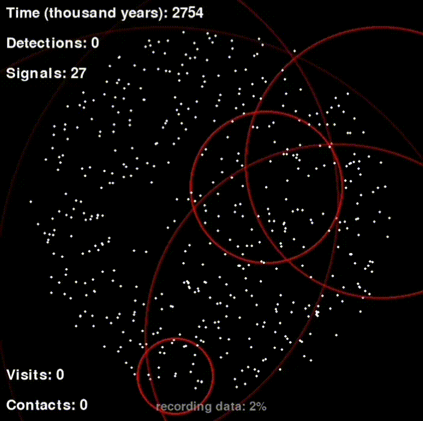

<h1 style="display: flex; align-items: center;">
    
    Fermi Paradox — English version
</h1>

Here you can find the English version of the code and a link to the executable `Fermi Paradox Simulation.exe` file to run the simulation.

[Download the executable](https://drive.google.com/uc?id=16_Q_O05kR91KQq4ykZqQ1lGk8F0oq3BT&export=download)

Enjoy!

    

